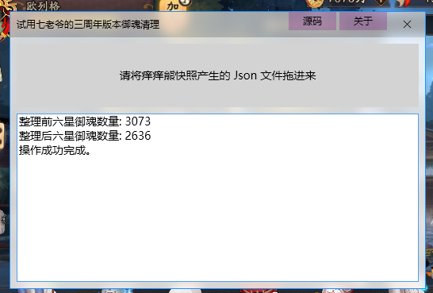

# LinqToOnmyoji
提供一组 .NET Standard 2.0 的 API，使用语言集成查询分析痒痒熊导出器导出的数据。

[查看 nuget 包](https://www.nuget.org/packages/Nukepayload2.Linq.Onmyoji/)

## 功能
- 导入痒痒熊快照产生的 json 文件 (已测试 痒痒熊 0.99.0)
- 使用强类型的 API 查询快照 json 文件的原始内容
- 对于过于原始的内容，如御魂种类编号，提供对应的枚举类型
- 提供一组对于中国人而言易用、一定程度上容错的 API 进行御魂整理

## 先决条件
### 开发人员
- 必备: 对阴阳师的游戏机制有足够的了解，能够编写攻略或者能看懂几乎所有攻略
- 必备: 熟悉 .NET 程序开发，C# 和 VB 至少要会一种
- 推荐: 掌握语言集成查询
### 开发环境
- 必备: .NET Core 3.0 SDK 或更高版本
- 推荐: Visual Studio 2019 16.3.1 或更高版本
- 推荐: .NET Framework 4.6.1 SDK 或更高版本 (部分示例项目使用)

## 快速入门
查询的入口是痒痒熊快照。加载快照之后对快照中的数据进行查询。
下面的代码使用 Linq 的 `Count` 函数统计御魂个数。

__VB__
```vbnet
Dim 快照 = 痒痒熊快照.加载Json文件("测试数据.json")
Console.WriteLine(快照.数据.御魂.Count)
```
代码产生如下输出
```console
4665
```

下面的代码统计每种御魂的数量。

__VB__
```vbnet
Dim 快照 = 痒痒熊快照.加载Json文件("测试数据.json")
Dim eqId = Aggregate 御魂 In 快照.数据.御魂
           Group By 御魂.名称 Into Group
           Select 名称, Group.Count Into ToArray

For Each eq In eqId
    Console.WriteLine(eq)
Next
```
代码产生形如如下的输出
```console
{ 名称 = 阴摩罗, Count = 131 }
{ 名称 = 心眼, Count = 182 }
{ 名称 = 破势, Count = 266 }
{ 名称 = 雪幽魂, Count = 123 }
...
```

下面的代码弃置五星御魂中瘸腿的和不含暴击+爆伤组合的，并比较弃置前后五星御魂数量

__VB__
```vbnet
' 加载快照
Dim 快照 = 痒痒熊快照.加载Json文件("测试数据.json")

' 整理前五星御魂数量
Dim 五星御魂 =
    From s In 快照.数据.御魂 Where s.星级 = 5 AndAlso s.已弃置 = False
Console.WriteLine($"整理前五星御魂数量: {五星御魂.Count}")

' 整理御魂
With 快照.数据.御魂.创建御魂整理
    .星级.选择(5)
    .副属性条数 = 副属性条数条件.两条
    .全选.弃置
    .副属性条数 = 副属性条数条件.不限
    .副属性没有.选择(御魂属性类型.暴击伤害)
    .全选.弃置
    .副属性没有.改为(御魂属性类型.暴击)
    .全选.弃置
End With

' 整理后五星御魂数量
Console.WriteLine($"整理后五星御魂数量: {五星御魂.Count}")
```
代码产生如下输出
```console
整理前五星御魂数量: 1033
整理后五星御魂数量: 321
```

## 示例程序
位于 "演示" 文件夹内，顺序无任何意义。

### 试用七老爷御魂清理的预览程序
使用七老爷的三周年版本御魂整理方案清理御魂，统计清理前后六星御魂数量



|名称|可运行的平台|使用的技术|
|-|-|-|
|测试控制台程序|Windows, Linux, Mac|VB|
|测试网站 [访问](http://nukepayload2.gitee.io/linqtoonmyojidemosite)|Web|C#, Blazor|
|演示WPF程序 [下载](https://gitee.com/nukepayload2/LinqToOnmyojiDemoSite/releases)|Windows|VB, WPF|

注: Windows 是指 Windows 10, Windows 8.1, Windows 7 sp1 或者它们对应的 Windows Server 系统。

### 关于示例程序的反馈追踪
- [试用七老爷御魂清理的预览程序的 nga 帖子](https://bbs.nga.cn/read.php?tid=18868381&_ff=538)

## 另请参阅
- [痒痒熊导出器 (fluxxu 制作)](https://bbs.nga.cn/read.php?tid=16557282)
